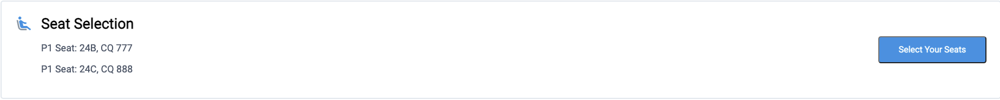

# :airplane: Flight Ticket Seats Selection 

 <h3 >A Selenium Web Scraping Project</h3>
 </br>
  <p>
    This Selenium scraper takes two seat numbers as input, selects the seats from a web page and then takes a screenshot of the "Seat Selection" element.
</p>
<p align="center">
<a>
    
  </a>
</br>
</br>

<!-- ABOUT THE PROJECT -->
## About The Project
This project was built with `Python3`, `Selenium` and `Visual Studio Code`.


<!-- GETTING STARTED -->
## Getting Started
Instructions for setting up your project locally ⬇️

### Prerequisites

<b>Update or install the following:</b>
* Python3 (v 3.9.5) - https://www.python.org/downloads/
* Selenium
  ```sh
  python3 -m pip install selenium
  ```
<b>Download and Include on $PATH:</b>
* Chrome Driver (v 91) - https://chromedriver.chromium.org/downloads


<!-- RUNNING -->
## How to run this program

1. Clone the repository
  ```sh
  git clone https://github.com/gpdavila/Flight-Seats-Web-Scrapping.git
  ```   
2. Open the terminal
3. Go to the folder where you stored the project
4. Call the program (app.py) passing the two seats as argument like the example bellow:
  ```sh
  python app.py 18A 20B
  ```
  
  &emsp; or
  
  ```sh
  python app.py A18 B20
  ```
  
5. You can now find the screenshot saved in the same folder


<!-- CONTACT -->
## Contact

Gabriel Piscoya Davila - gpiscoya2013@hotmail.com
</br>
</br>
[![LinkedIn][linkedin-shield]][linkedin-url]

Project Link: [https://github.com/gpdavila/Flight-Seats-Web-Scrapping](https://github.com/gpdavila/Flight-Seats-Web-Scrapping)


<!-- MARKDOWN LINKS & IMAGES -->
[linkedin-shield]: https://img.shields.io/badge/-LinkedIn-black.svg?style=for-the-badge&logo=linkedin&colorB=555
[linkedin-url]: https://linkedin.com/in/gabrielpiscoyadavila
